# Capability Layering: generic dev mechanism / fkst run-ops / self-diagnosis

> Status: **design accepted** (2026-06-15) via sshx worker-delegated inline consensus.
> Scope: `fkst-packages` — a boundary definition, decision rule, and layering-ownership map for three capabilities that were entangled. This document is **analysis/design only**; it specifies *where things belong* and a staged remediation, not a code change.
> 中文摘要：本文厘清仓内被混淆的三种能力（通用自驱开发 / fkst 运行运维 / fkst 自我诊断），给出心智模型、判定规则、逐 surface 归类、分层归属与分阶段改造计划。



*Figure: the target layering — Plane 1 (generic dev mechanism) and Plane 2 (fkst run/ops policy), the cross-cutting diagnosis control loop, the `fkst-substrate` engine foundation, and the P0/P1/P2 roadmap. Source: [`2026-06-15-capability-layering.mmd`](./2026-06-15-capability-layering.mmd) (PNG render: [`.png`](./2026-06-15-capability-layering.png)).*

## 1. Problem / 问题

The repository fused three different concerns to the point of being hard to reason about:

1. **Generic autonomous development** — project-agnostic "given a GitHub repo + issues, develop to merge". It already runs against `fkst-substrate` issues, so it is inherently reusable.
2. **fkst-specific run/ops** — how *this* dogfood deployment is run and operated (topology, branches, board, substrate pin).
3. **fkst self-driven diagnosis** — the system watching its own health and filing issues / self-healing.

The muddle showed up concretely in: one global `github-devloop/core.lua` installing all three concerns into a single table (`core.lua:7-58`); `scripts/run.sh` mixing dev/ops/diagnosis under one command surface; `core/observability.lua` mixing census, dashboard, reaper, and starvation; `core/config.lua` mixing generic knobs with dogfood topology; and two unrelated `doctor` surfaces sharing a name.

## 2. Mental model: two planes + one cross-cutting control loop / 心智模型

Do **not** model these as three sibling products. The correct cut is **two planes plus one cross-cutting control loop**:

```
┌──────────────────────────────────────────────────────────────┐
│ Plane 1 — generic autonomous-development MECHANISM (data plane)│
│   "any GitHub repo: issue/PR → implement → PR-review consensus │
│    → merge"  =  github-proxy(adapter) + consensus(judge)       │
│                 + github-devloop lifecycle                     │
├──────────────────────────────────────────────────────────────┤
│ Plane 2 — fkst run/ops POLICY (deployment policy over Plane 1) │
│   dogfood topology / branches / rollup / substrate-pin /       │
│   board / repo-setup                                           │
└──────────────────────────────────────────────────────────────┘
        ▲                                            │
        │ files issues / bounded redrive             │ consumes facts
        └────────  DIAGNOSIS control loop (cross-cutting)  ◀──────┘
           doctor · liveness · dead_letter · state_gap ·
           queue_starvation · rollup_health · error_facts
```

Key correction to the original framing: **diagnosis is not a third product**. It is a control loop that consumes engine/package facts, asserts liveness, and feeds Plane 1 by filing issues or bounded redrive. Treating it as a co-equal third "capability" was itself a source of the confusion.

中文：你感觉「乱」的根因之一，是把**诊断**当成了与开发、运维并列的第三个产品。它其实是一个**横切控制环**——只读消费事实、断言活性、出问题回灌 Plane 1（立 issue / 有界 redrive）。

## 3. Decision rule / 判定规则

> **Classify by effect/action, not by filename and not by the data it touches.**
> - Advances a managed GitHub issue/PR toward merge for *any* repo → **Plane 1**.
> - Configures/renders *this* deployment's topology/host → **Plane 2**.
> - Detects errors / stalls / "should-have-happened-but-didn't" and files-or-redrives repair → **Diagnosis**.
> - Project-agnostic engine fact/primitive → **belongs in `fkst-substrate`**, not this repo.

Shared telemetry is neutral base data; classify it by the **consumer's action**. This rule is what disambiguates the fuzzy surfaces in §5.

Grounded in `CLAUDE.md` doctrine: 分层归属 (`CLAUDE.md:96-102`), flat-vs-composed (`CLAUDE.md:28-30`), 错误处理三级模型 (`CLAUDE.md:48-66`), 活性⟂安全, 门控即管线.

## 4. Classification manifest (file-level exhaustive) / 逐 surface 归类

The full per-surface manifest (every department, raiser, core module, script across all five packages + `scripts/`) was verified file-by-file. Two of three independent reviewers confirmed it omits **no** file-level surface. Grouped form:

### Plane 1 — generic development mechanism
- **Packages (shared):** `consensus/decide` (judgment engine), `consensus/core` + prompts; `github-proxy` all in/outbound adapters (`github_poll`, `github_comment`, `github_pr_comment`, `github_pr_open`, `github_issue_label`, `github_issue_create`, `github_issue_blocked_by`) + adapter core (`comment`, `issue_create`, `blocked_by`, `rest_view`, `entity_view`, `gh_rate`, `claims`).
- **github-devloop departments:** `comment_handoff`, `consensus_result`, `decompose`, `fix`, `implement`, `intake_scan/probe/judge`, `loop`, `merge`, `open_pr`, `review_pr/result/loop/meta`; `observe_issue`, `observe_pr`, `reconcile` (the last three carry a **diagnosis hook** — see §5).
- **github-devloop core:** lifecycle group (`base`, `state`, `markers`, `entity`, `payloads`*, `requests`, `reconcile_requests`, `pr_label_requests`, `review_meta_requests`, `validators/**`, `restart/**`, `convergence`, `dependencies`, `claims`, `context_bundle`, `implement_attempt`, `impl_failure`, `decompose`, `review_carry_over`, `review_redrive`, `pr_review_replayer`, `replayer`, `saga`, `forks`, `intake_*`, `operator_commands`); merge group (`queue`, `merge_batch`, `merge_gate` + `reason_classes/*`, `pr_safety`); generic posture knobs in `config.lua` (`FKST_GITHUB_WRITE`/`write_mode`, `FKST_DEVLOOP_MAX_INFLIGHT`, `FKST_DEVLOOP_MANAGED_SIBLING_REPOS`, `FKST_DEVLOOP_TEST_COMMAND`, `FKST_DEVLOOP_INTAKE_PROBE_PROOF`, `FKST_OUTPUT_LANG`, and lifecycle-consumed identity/auth `FKST_GITHUB_REPO`/`FKST_GITHUB_BOT_LOGIN`/`GH_TOKEN`/`GITHUB_TOKEN`).
- **raisers:** `intake_poll`, `intake_probe_poll`, `merge_queue_poll`.

\* `payloads` and `prompts` are file-level Plane 1 but contain Plane 2 builders — see §6 P1 targets.

### Plane 2 — fkst run/ops policy
- **departments:** `ensure_repo`, `sync_scan`, `sync_conflict`, `pr_freshness_scan`, `rollup_merge`, `substrate_ref_scan`; `rollup_scan` (**diagnosis hook**: calls `rollup_health` issue creation).
- **core:** ops group (`config.lua` topology knobs — `FKST_DEVLOOP_UPSTREAM_BRANCH`, `FKST_DEVLOOP_INTEGRATION_BRANCH`, `FKST_DEVLOOP_ROLLUP_MERGE`, `FKST_DEVLOOP_ROLLUP_RED_WINDOW_MINUTES`, `FKST_DEVLOOP_RELEASE_NOTES_FALLBACK`, `FKST_DEVLOOP_BOARD_CMD`, `FKST_DEVLOOP_CONFLICT_LOG_CMD`); `branches` (topology), `release_notes`, `ensure_repo`, `substrate_ref`.
- **scripts:** `board.py`, `doctor.sh` (host preflight), `check_repo.py`, `bin_bootstrap.sh`, `bin_cache.py`; `run.sh` `supervise/build/board`.
- **raisers:** `branch_poll`, `ensure_repo_poll`, `substrate_ref_poll`.

### Diagnosis — cross-cutting control loop
- **departments:** `dead_letter`, `doctor`, `liveness_scan`, `observability` (internally mixed — see §6).
- **core:** `error_facts`, `liveness`, `doctor`, `state_gap`, `queue_starvation`, `rollup_health`, `conflict_telemetry`; `consensus/dead_letter`; `github-proxy/error_facts`; error fields of `logging`.
- **raisers:** `liveness_poll`, `observability_poll`.

### Explicitly excluded (not part of this question) / 显式排除
- `autochrono` + `github-autochrono` — a **separate product line** (`issue → consensus → reply`), not dev-loop/ops/diagnosis. Listed so the manifest is fail-closed, not silently dropped. Note `github-proxy` and `consensus` are **shared** by both product lines and are classified above by their dev-loop role.
- All `tests/*.lua` / `*_test.py` — verification harness, classified through the runtime surface they test.

## 5. Fuzzy-boundary adjudications / 模糊边界裁定

1. **Observability is not one bucket.** Generic observe/queue/DLQ/timeline data → `fkst-substrate`; `board.py` + `dashboard` rendering → Plane 2; `queue_starvation` / `state_gap` / `rollup_health` / conflict hotspots → Diagnosis; `reaper` (orphan-PR cleanup) → Plane 1.
2. **Reconcile is trigger-split.** consensus / review / fix true-stall reconcile = Plane 1 deterministic no-codex CAS/drop backstop; `devloop_timeout_reconcile` = Diagnosis.
3. **`rollup_scan` = Plane 2 + diagnosis hook.** Rollup policy is topology-specific; `rollup_scan:173` may file a repair issue via `rollup_health`.
4. **`github-proxy` is a shared adapter that currently leaks devloop knowledge** (`current_devloop_state`, `fkst-dev:*` label colors/guards, PR marker guards) — those leaks must move out of the shared adapter.
5. **Two doctors, one name.** `scripts/doctor.sh` = host preflight; `github-devloop/departments/doctor` = in-system saga/liveness doctor. Rename by concern in docs/CLI.
6. **Keep `github-devloop` composed.** It genuinely consumes/produces `github-proxy.*` and `consensus.*` (`fkst.toml` `[event_deps]`); flattening it would duplicate the adapter + judgment engine and violate the composed-package doctrine. The fix is in-package capability decomposition, **not** flattening.

## 6. Staged remediation / 分阶段计划

### P0 — clarity, zero structural risk, reversible (recommended first)
- Add this capability-boundary map to docs; annotate `departments/`, `raisers/`, and `core.lua` install groups by bucket.
- Group `scripts/run.sh` help + README by **dev / ops / diagnosis**.
- Rename the two `doctor` surfaces in docs/CLI wording only.

### P1 — god-package decomposition (no deprecated shims; delete old shapes when moved)
Split mixed surfaces by concern. The concrete intra-module split targets (the actionable list reviewers converged on):
- `core/observability.lua` → census / dashboard (Plane 2) · reaper (Plane 1) · starvation+conflict (Diagnosis).
- `core/reconcile` → split by trigger class (Plane 1 deterministic vs Diagnosis timeout).
- `core/prompts.lua` → `build_sync_conflict_prompt` is Plane 2; `implement/fix/intake/decompose/review_meta/fix_reflection` builders are Plane 1. `prompts/sync_conflict.lua` resource is Plane 2.
- `core/payloads.lua` → board feed/digest rendering (`FKST_DEVLOOP_BOARD_CMD`, digest) is Plane 2; proposal payload builders are Plane 1.
- `core/config.lua` → already specified as a per-knob split in §4 (generic posture vs dogfood topology).
- `core/commands.lua`, `core/branches.lua` → split caller-by-caller (lifecycle vs ops support).
- **Clean all `github-proxy` devloop leaks:** label colors/guards (`github-proxy/core.lua:758-778`, `github_issue_label/main.lua:88-110`), `github_poll` `fkst-dev` intake logic (`github_poll/main.lua:24-37`), `github_pr_open` devloop marker/state guards (`github_pr_open/main.lua:79-164`). Replace with generic caller-supplied guards.

> Note (provenance): a strict per-function manifest keeps surfacing "one more mixed module" precisely because the package fuses planes at module granularity. That convergence is *evidence for* P1, and the real fix is doing these splits in code with tests — not enumerating them further on paper.

### P2 — down-shift generic primitives to `fkst-substrate` (cross-repo)
Move only project-agnostic facts/primitives into the engine (engine work belongs in the `fkst-substrate` repo, per 分层归属).

## 7. What moves to `fkst-substrate` vs what stays / 下沉清单

**Move (generic, project-agnostic):** machine-readable `observe --json` (entity timeline / event ledger / queue / DLQ state); queue/DLQ depths and delivery attempts; cron/raiser next-fire & last-fire facts; structured failure facts (`error_class`, `fingerprint`, `source_ref`, `attempt`, `terminal`); rate-pool capacity/usage/throttle facts; generic source-ref / version-CAS / saga primitives once project-agnostic.

**Keep in this repo (package/project policy):** `scripts/board.py` rendering; GitHub marker parsing; `fkst-dev:*` labels; `fkst:github-devloop:*` semantics; dogfood branch topology; substrate-ref bump policy; rollup/sync policy; diagnosis issue wording.

## 8. Provenance / 决策过程

Decided via `consensus-rnd:sshx` worker-delegated inline consensus (all workers = `codex-cli`, read-only sandbox, isolated):
- Thinking triplet (minimal / structural / delete) → all `propose`; meta-judge exit `meta-layer convergence`.
- Implementation worker synthesized + verified against ~120 source files (5 corrections).
- Review triplet over 3 rounds: round 3 returned **architecture: approve, quality: approve, tests/rigor: reject** on finer intra-module splits (folded into §6 P1 targets). Accepted by explicit user decision; the residual rigor item is P1 implementation work, not an analysis defect.

AI:FKST
